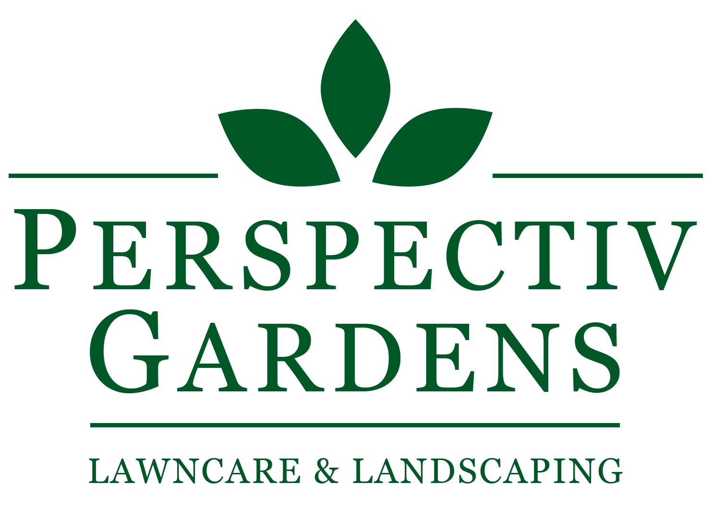

  

<h1 align="center" style="color: #005826">
  Perspectiv Gardens
</h1>

## 💫 Deploy

[perspectivgardens.com](https://perspectivgardens.com/) is deployed on Netlify and this image automatically updates to reflect the current state of your latest production deploy.
